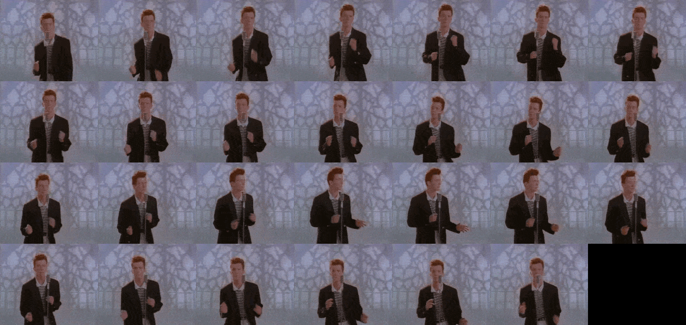

<h1>GIFs dentro da Unity</h1>

Procedimento para facilmente inserir GIFs dentro de objetos produzidos pela Unity.

---

1) Transformar o GIF em um PNG contendo todos os frames através do site https://tool.koalahollow.com/gifconverter

- Acessar o site e realizar o upload do GIF desejado.

- Selecionar o formato "PNG" e o tipo em grade, para que o resultado seja como a imagem abaixo.

- Renomear como desejar e realizar o download.
2) Dentro da Unity, separar os frames.
  - Importe o PNG resultante da última etapa para dentro da Unity.
  - Escolha o formato da imagem como "Sprite (2D and UI)" e na nova opção "Sprite Mode" selecione "Multiple".
  - Abra o menu "Sprite Editor", isto irá abrir a imagem em uma nova janela.
  - No menu "Slice" selecione o "Type" como "Grid by Cell Count".
  - Conte o número de linhas e colunas de frames diferentes e coloque os valores nas opções do menu de "Slice".
  - Aplique o corte clicando no botão "Slice" no final do menu e então, caso haja frames pretos "sobrando" no fim da imagem, selecione e delete cada um individualmente.
  - Confirme as alterações apertando em "Apply" e feche o menu.
3) Criar objeto que irá conter o GIF.
  - Na cena desejada, crie um objeto que possua um componente de Image ou Sprite.
  - Abra o menu de animação da unity e crie um Animation Clip para este objeto.
  - Dentro da linha do tempo de animação, arraste todas as imagens que foram geradas pela divisão da imagem original.
  - Arrastando a barra azul no final dos keyframes, ajuste o espaçamento das imagens para o GIF tocar no tempo desejado.
4) Após estes passos, o GIF deve estar funcionando e deve executar automáticamente ao se iniciar o jogo.
5) Caso seja desejado Loop do GIF ou um carrosel de múltiplos GIFS, isso pode ser realizado ajustando as configurações do Animation Controller e criando novos Animation CLips.
